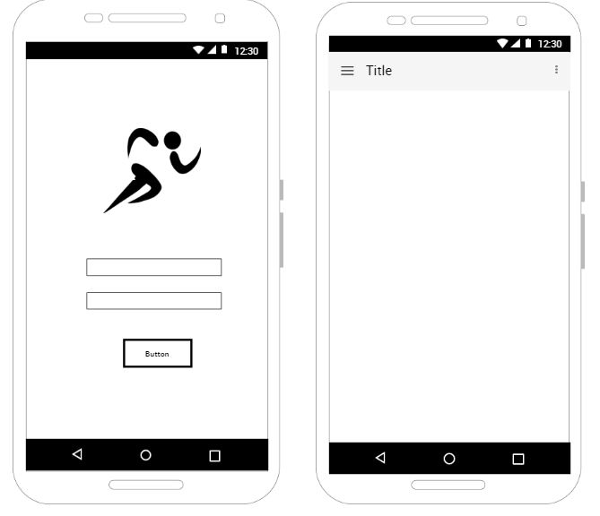

# UHealth

> **By Vanessa Palacios Sharma**



## __Description__


###### Uhealth helps you keep track of your fitness goals using the Fitbit and Youtube APIs.


## Known Bugs

> **No Known Bugs**


```
  clone repo using Android Studio checkout Project using VCS
  run application
  select emulator
    * preferably Nexus 6 API 23
  enjoy!
  ```


**Access the remote repository :** [vanessasharma](https://github.com/VanessaSharma/UHealth)


Legal
------

_*Copyright (c) 2017 Vanessa Palacios Sharma*_

###### This software is licensed under the MIT license.


